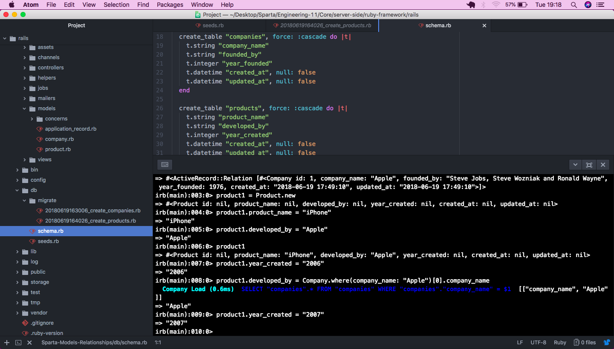

# 
 Sparta Models Relationships 

#### Task:

Your homework is to go over everything we covered today and build out another Rails project

**Your project must have:**

* 3 resources (models) of your choice 
* 2 of your resources must have a One-to-Many relationship with each other
* a seed file for one resource minumum (you can use Faker if you want)
* 2 of your resrouces must have validations (3 minimum each)
* Homeworks must follow the Homework Definition of Done mentioned in the Teams channel

**Some key commands:**

* rake db:drop
* rake db:create
* rake db:migrate
* rake db:seed
* This homework is to help you practice Active Record associations and navigating the rails console, so you will need to use the documentation

This task makes use of:

* [Faker gem](https://github.com/stympy/faker)

**How to Download** - click 'clone or download' button, download a zip of our project, unzip, open the index.html and enjoy.

#### Challenges:

Instead of going directly with what I was shown in the lesson, I thought I'd try to do something different - instead of creating a one to many relationship via IDs (in my case, add the Company model ID to the relative column in the products table), I tried to link the 'company_name' column from the Companies table to the 'company_name' column in the products table (this can be viewed on my dev branch and below):

I soon ran into many problems which eventually made me realise that I am potentially trying to run before I can walk.

#### Summary:

This task was mostly straightforward for me until I tried to think outside the box and do something different. What I might try to do next to is to add another column called 'company_name' inside the product table (alongside company_id) and find a way to represent that data as I feel it would be better, from a user's perspective, to be able to view the company's name straightaway.
